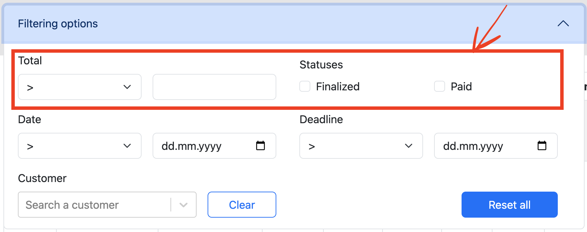

# Ideas

### 1) Sort and Search invoices functionality

- It is a good practice working with lists to have not only a filtering functionality, but also sort and search.
It will make the user experience much better by allowing to find the needed invoice faster
- After searching in the provided [documentation](https://pennylane.readme.io/docs/getting-started), 
I didn't find the sort and search functionality implemented on BE.
- It is possible to implement all those on FE, but for that we need to fetch the whole list, which can be painful
in terms of timing (bad user experience during the first fetching). As now, we do have the pagination and the filtering
provided by BE, so all the rest (search and sort) need to be provided by BE as well.

### 2) Create, Update and Delete (CUD) customer and product functionality

- It is not directly related to invoice management itself, it can be done elsewhere. But it would be useful
if user could update the customer or the product right on the way of the invoice management.
- After searching in the provided [documentation](https://pennylane.readme.io/docs/getting-started),
I didn't find the customer and product CUD functionality implemented on BE.

### 3) Financial invoice fields consistency

- `invoice_line.tax` not always equal to `invoice_line.product.unit_tax * invoice_line.quantity`.
Issue is in the numbers rounding. Numbers should have some optimal decimals number to enable the expression above to be truthy.
- While user is updating the invoice line product, or it's quantity, or adding/removing the invoice lines,
the invoice line's `Price` and `Tax` fields, as well as the overall invoice `Total` and `Tax` fields should be modified on UI
- Such UI calculations will make the UX better, because all data are looking consistent across user's changes

### 4) Add filtering by product

- Even if the product is the part of the invoice lines, it would be useful for the user to search invoices by product.
- As now filtering is providing by API in pagination format, so the new one should be done the same way.

### 5) Filtering functionality fixing and updating



- After checking the [filtering API](https://pennylane.readme.io/docs/filter-my-invoices) I've tried to implement the filtering
by `amount` and by `status`, but they are not working: 

``` filter: [{"field":"amount","operator":"lt","value":"1"}] ```

or

``` filter: [{"field":"status","operator":"eq","value":"paid_status"}] ```

also, according the doc, there is no one specific `status` for the `finalized` invoices. It provides a bunch of statuses, so I've tried:

``` filter: [{"field":"status","operator":"eq","value":"upcoming_status,late_status,cancelled_status,partially_cancelled_status"}] ```

as well as

``` filter: [{"field":"status","operator":"eq","value":["upcoming_status","late_status","cancelled_status","partially_cancelled_status"]}] ```

- Normally those issue need to be fixed on BE
- It will allow user to filter by `isPaid`, `isFinalized` and by the `amount`

### 6) Add possibility to download the invoice

- It would be useful if the user will need to share this invoice or just to keep it
- BE can provide the API which will return the .doc or .pdf file for some specific invoice
- Also, some electronic signature can be added (some binary code or barcode or even visual signature and stamp)
- The signature will make it a real valid document
- FE will implement the invoice downloading functionality for example like so:

```js
  let a = document.createElement('a');
  a.setAttribute('href', fileUrl);

  if (isPDF) {
    a.setAttribute('target', '_blank');
  } else {
    a.setAttribute('download', fileName);
  }

  a.click();
  a = null;
```

### 7) Add possibility to download the invoice's payment receipt

- It is nice to have a valid payment proof, so users can appreciate such functionality
- The implementation path is roughly the same as in the idea № 5

### 8) Fill in bulk

- Let's imagine you have to create many invoices at the same time
- Fill all needed data in the table, where each line is dedicated to the separate invoice
- Send this array of objects to BE (API need to be implemented) and voila, the bulk of invoices was created

### 9) Payment system integration

- It is more about the final invoice user, not about the whole invoices manager
- Instead of just setting `paid: true\false` we can integrate some payment system (for example Stripe)
